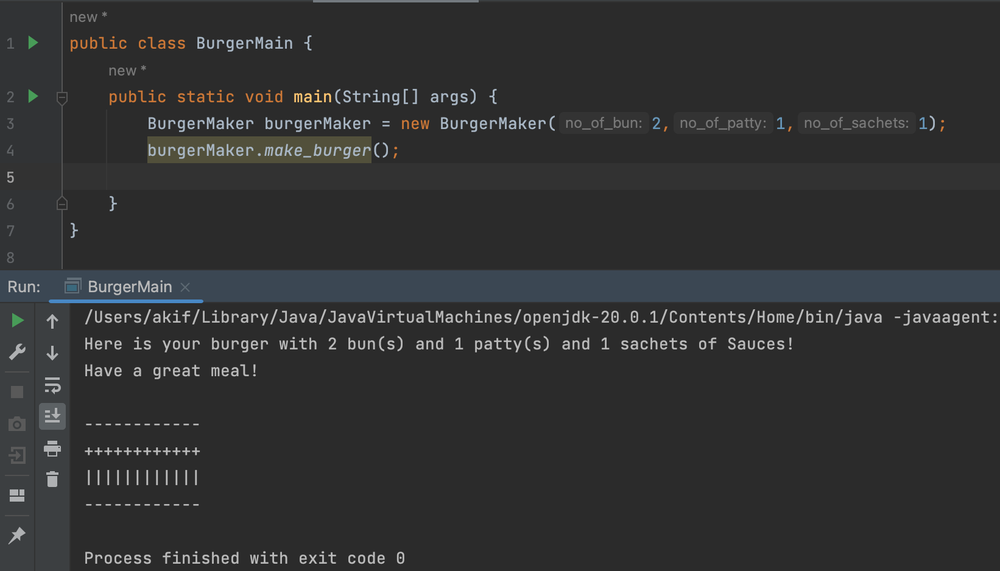

# Multiple-Inheritance with Burger-Bun-Patty
This program is a super basic multiple inheritance example with 3 classes. This is a burger making program where the burger maker extends buns class and buns class extends patty class.

# Object Oriented Design and Design Patterns Lab<br> CSE 4122
## Author
Akif Islam<br>
Department of CSE, University of Rajshahi<br>
iamakifislam@gmail.com<br><br><br>

## Experiment
<p>Demonstration of Multiple Inheritance in Java</p>

## Diagram


## How to Run?
```bash
  $javac BurgerMain.java
  $java BurgerMain
```

## Output


